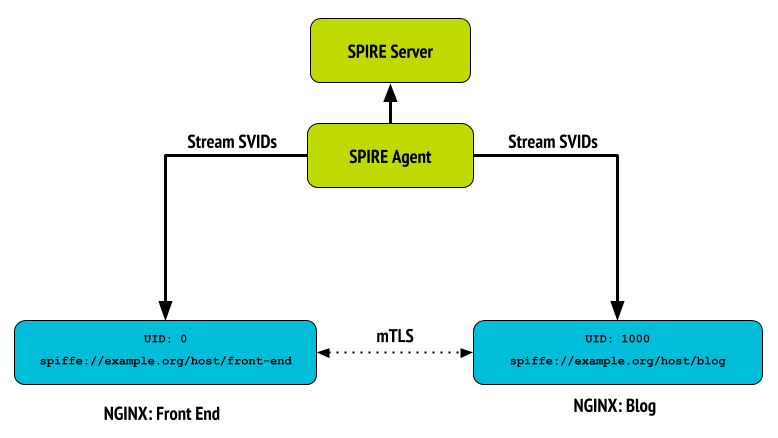

# Securing NGINX microservices with SPIFFE

We will demonstrate how we integrated NGINX and SPIRE. First, we built an NGINX module that natively supports the SPIFFE Workload API. This allows NGINX to receive X.509-SVIDs in a gRPC stream, where certificates are pushed, not polled. Next, we modified various built-in NGINX modules to process inbound/outbound HTTPS connections based on a list of allowed SPIFFE IDs that one can specify in an NGINX configuration file. This is done entirely within NGINX without requiring the help of a separate helper application.

Here’s a quick video taking you through the details. If you’re interested in more, keep reading below the video.

[Video: Securing NGINX microservices with SPIFFE]()

The video above shows the aforementioned, simulating the presence of a front-end server proxying the connections to a blog service:



For this integration with SPIFFE, NGINX was modified to natively support the Workload API and get the X.509-SVIDs in a gRPC stream, store them on disk, and signal to load the new credentials when they are available. SPIRE-issued certificates have a one-hour expiry by default, which can be changed with a [ttl parameter](https://github.com/spiffe/spire/blob/master/doc/spire_server.md#spire-server-entry-create) when the entry is registered. The newly created NGINX module handles both receiving (as they are pushed over the stream) and loading certificates (when they are received).

## Modifications done to get SPIFFE support in NGINX

| NGINX Component   | Modifications                            |
| ----------------- | ---------------------------------------------- |
| ngx_event_openssl | Add function to extract the SPIFFE ID from the peer certificate and check for allowed SPIFFE IDs. Enable the X509_V_FLAG_PARTIAL_CHAIN flag. Unless it’s explicitly enabled by this flag, OpenSSL does not trust certificates issued by an intermediate CA without having to trust its ancestor root CA. |
| ngx_http_ssl_module   | Add configuration directives for SPIFFE ID validation of clients in HTTPS servers: <ul><li>`ssl_spiffe`</li><li>`ssl_spiffe_accept`</li></ul> |
| ngx_http_proxy_module   | Add configuration directives for SPIFFE ID validation of proxied HTTPS servers: <ul><li>`proxy_ssl_spiffe`</li><li>`proxy_ssl_spiffe_accept`</li></ul> |
| ngx_http_upstream | Accept or reject proxied connections to servers based on allowed SPIFFE IDs for the servers, specified in `proxy_ssl_spiffe_accept`. |
| ngx_http_request | Accept or reject client connections based on allowed SPIFFE IDs for clients, specified in `ssl_spiffe_accept`. |
| ngx_http_proxy_module   | New module that interacts with the Workload API to receive X.509-SVIDs in a gRPC stream and store them on disk. Add the following configuration directives to specify the SPIFFE Workload Endpoint address and the paths to store the certificates: <ul><li>`ssl_spiffe_sock`</li><li>`svid_file_path`</li><li>`svid_key_file_path`</li><li>`svid_bundle_file_path`</li></ul> |

## Sample scenario

The example shows our NGINX module implementing the Workload API to get X.509-SVIDs in order to perform mTLS. The scenario simulates the presence of a front-end server proxying the connections to a blog service. Each side allows ingress or egress connections based on the SPIFFE IDs that are configured in the NGINX configuration file.

The SPIRE Server maintains the registration entries of workload identities and attestation policies, and is responsible for validating and signing all CSRs in the SPIFFE trust domain. The validation is performed through platform-specific attestation plugins, as well as policy enforcement backed by the SPIRE Server datastore. In the above example, the front-end server’s identity is `spiffe://example.org/host/front-end`, while the blog’s identity is `spiffe://example.org/host/blog`.

| Workload        | SPIFFE ID                           | Selector      |
| --------------- | ----------------------------------- | ------------- |
| NGINX Front-end | spiffe://example.org/host/front-end | unix:uid:0    |
| NGINX Blog      | spiffe://example.org/host/blog      | unix:uid:1000 |

The SPIRE Agent runs on every node and is responsible for requesting certificates from the SPIRE Server, attesting the validity of local workloads using selectors, and providing them SVIDs. In this case, we are going to register the workloads using UID Unix selectors that will be mapped to the corresponding SPIFFE ID.

## NGINX Configuration

A new set of configuration directives has been added to enable the SPIFFE integration with NGINX. They must be placed under the server block.

### Interact with the Workload API

NGINX configuration directives added to interact with the Workload API:

```
# Socket path of SPIRE Agent
ssl_spiffe_sock /tmp/agent.sock;

# File path to store SVID in PEM format
svid_file_path /certs/front_end_svid.pem;

# File path to store SVID Private Key in PEM format
svid_key_file_path /certs/front_end_svid_key.pem;

# File path to store SVID Bundle (CA certificates belonging to the Trust Domain) in PEM format
svid_bundle_file_path /certs/front_end_svid_bundle.pem;
```

### Control the acceptance of clients in HTTPS servers

The following directives are used to control the acceptance of clients in HTTPS servers, based on the SPIFFE ID:
```
# Enable or disable SPIFFE ID validation of clients in HTTPS servers
ssl_spiffe on;

# List of SPIFFE IDs to accept from client's certificate
ssl_spiffe_accept spiffe://example.org/host/front-end;
```

### Control the acceptance of certificates presented by the proxied server

When the server is proxying connections to another server, the following directives are used for the SPIFFE ID validation of certificates presented by the proxied server:

```
# Enable or disable validation of SPIFFE ID of proxied HTTPS server
proxy_ssl_spiffe on;

# List of SPIFFE IDs to accept from proxied server
proxy_ssl_spiffe_accept spiffe://example.org/host/blog;
```

### Front-end: Complete Configuration Example

```
daemon off;
worker_processes 1;
error_log /dev/stdout debug;
events {
  worker_connections 1024;
}

http {
  server {
    listen      80;
    server_name localhost;

    # Fetch SVIDs
    # Socket path of SPIRE Agent
    ssl_spiffe_sock       /tmp/agent.sock;

    # File path to store SVID in PEM format
    svid_file_path        /certs/front_end_svid.pem;

    # File path to store SVID Private Key in PEM format
    svid_key_file_path    /certs/front_end_svid_key.pem;

    # File path to store SVID Bundle (CA certificates belonging to the Trust Domain) in PEM format
    svid_bundle_file_path /certs/front_end_svid_bundle.pem;

    proxy_ssl_verify              on;
    proxy_ssl_certificate         /certs/front_end_svid.pem;
    proxy_ssl_certificate_key     /certs/front_end_svid_key.pem;
    proxy_ssl_trusted_certificate /certs/front_end_svid_bundle.pem;

    # Enable or disable validation of SPIFFE ID of proxied HTTPS server
    proxy_ssl_spiffe on;

    # List of SPIFFE IDs to accept from proxied server
    proxy_ssl_spiffe_accept spiffe://example.org/host/blog;

    location / {
      root   html;
      index  index.html index.htm;
      proxy_pass https://127.0.0.1:8443$request_uri;
    }
  }
}
```

### Blog: Complete Configuration Example

```
daemon off;
worker_processes 1;
error_log /dev/stdout debug;
events {
  worker_connections 1024;
}

http {
  server {
    listen       8443 ssl;
    server_name  localhost;

    # Fetch SVIDs
    # Socket path of SPIRE Agent
    ssl_spiffe_sock       /tmp/agent.sock;

    # File path to store SVID in PEM format
    svid_file_path        /certs/blog_svid.pem;

    # File path to store SVID Private Key in PEM format
    svid_key_file_path    /certs/blog_svid_key.pem;

    # File path to store SVID Bundle (CA certificates belonging to the Trust Domain) in PEM format
    svid_bundle_file_path /certs/blog_svid_bundle.pem;

    ssl_verify_client on;
    ssl_certificate         /certs/blog_svid.pem;
    ssl_certificate_key     /certs/blog_svid_key.pem;
    ssl_client_certificate  /certs/blog_svid_bundle.pem;

    # Enable or disable SPIFFE ID validation of clients in HTTPS servers
    ssl_spiffe on;

    # List of SPIFFE IDs to accept from client's certificate
    ssl_spiffe_accept spiffe://example.org/host/front-end;

    location / {
      root   html;
      index  index.html index.htm;
    }
  }
}
```

## Let’s try it!

To try this yourself, clone the [spiffe-example](https://github.com/spiffe/spiffe-example) repository and follow the steps below:

### Prerequisites

- macOS or Linux system
- [Docker](https://docs.docker.com/install/)
- [Docker Compose](https://docs.docker.com/compose/install/)
- [GNU Screen](https://www.gnu.org/software/screen/)

### Step 1: Build the example

Running `make` from within the [dupin](https://github.com/spiffe/spiffe-example/tree/master/dupin) directory will build a Docker image with everything you need to try this integration. Then, run `make demo` to open the environment where we can interact with NGINX with SPIFFE support. This will show six terminals: `spire-server`, `spire-agent`, `nginx-blog`, `nginx-fe`, `certs` and `nginx-conf`. At this point we are ready to start configuring SPIRE and NGINX.

### Step 2: Run SPIRE Server

Let’s start by running SPIRE Server in the `spire-server` terminal:

``` shell
/opt/spire# ./spire-server run
```

Once we have it running, we can start executing commands on the spire-server and join an agent to it using the join token attestation method. A join token is a manually generated single-use token that can be used to authenticate a connection. In more sophisticated implementations, SPIRE can be configured to use platform-specific mechanisms to authenticate an agent to a server.

### Step 3: Register Workloads

We need to create the registration entries that will be used to attest the workloads, which in our case are the NGINX processes. We can use the `spire-agent` terminal for that:

``` shell
/opt/spire# ./spire-server entry create \
-parentID spiffe://example.org/host \
-spiffeID spiffe://example.org/host/front-end -selector unix:uid:0 \
-ttl 60
```

This is describing that we want to assign the SPIFFE ID spiffe://example.org/host/front-end to attested workloads that run with the Unix UID 0, and the certificate issued will expire in 60 seconds. Similarly, we need to create an entry for the NGINX acting as blog. The built container has already created a user nginx-blog, with UID 1000. Let’s create the registration entry for that:

```shell
/opt/spire# ./spire-server entry create \
-parentID spiffe://example.org/host \
-spiffeID spiffe://example.org/host/blog -selector unix:uid:1000 \
-ttl 60
```

### Step 4: Join Token

We also need to add the registration entry to attest this node. We will generate a one-time Join Token via spire-server token generate sub command, using the -spiffeID option to associate the Join Token with spiffe://example.org/host. The Join Token will be used for node attestation and the associated SPIFFE ID will be used to generate the SVID of the attested node:

``` shell
/opt/spire# ./spire-server token generate \
-spiffeID spiffe://example.org/host
```

### Step 5: Run SPIRE Agent

We are now ready to run SPIRE Agent using the previously generated Join Token:

``` shell
/opt/spire# ./spire-agent run \
-joinToken {previously generated token}
```

### Step 6: Run NGINX Servers

SPIRE Server and SPIRE Agent are now running and ready to attest our workloads and generate the corresponding SVIDs. The environment is already provisioned with sample configuration files for the NGINX front-end and the NGINX blog servers. The `nginx-blog` terminal can be used to launch the NGINX acting as a blog:

``` shell
/opt/spiffe-nginx# su -c "./nginx -c /usr/local/nginx/nginx_blog.conf" nginx-blog
```

In the same way, we use the `nginx-fe` terminal to launch the NGINX server acting as a front-end that proxies the connections to the blog:

``` shell
/opt/spiffe-nginx# ./nginx -c /usr/local/nginx/nginx_fe.conf
```

### Step 7: Verify

At this point, NGINX is serving a sample page that should be accesible at http://localhost.

Two additional terminals are provided to facilitate the use of this example. The `certs` terminal can be used to analyze the stored certificates (e.g. by running openssl commands to inspect the certificates). The `nginx-conf` terminal can be used to display and edit NGINX configurations. (**Hint**: try changing the allowed SPIFFE IDs in the `ssl_spiffe_accept` and `proxy_ssl_spiffe_accept` configuration directives :)
