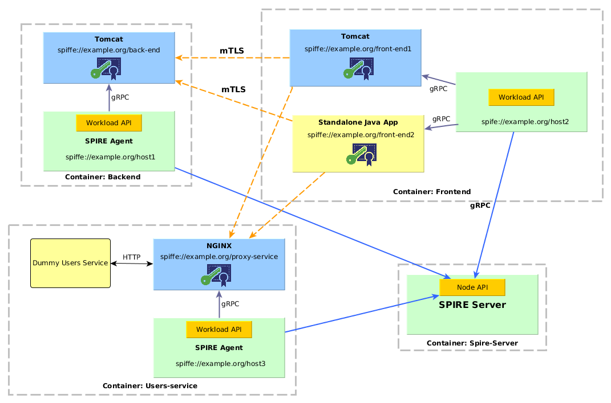

# SPIFFE based KeyStore/TrustStore and Tomcat

This demo shows an example using a SPIFFE based KeyStore implemented in the [JAVA-SPIFFE library](https://github.com/spiffe/java-spiffe)
to authenticate Tomcat's workloads.

The SPIFFE KeyStore interacts with the Workload API to fetch asynchronously the SVIDs and handle the certificates in memory. Certificates
updates are pushed by the Workload API before expiration.  

mTLS connections are handled by the Tomcat, that has a connector configured to use a `Spiffe` KeyStoreType.

This demo is based on SPIRE version 0.6.0.


## Demo scenario 

### Components

This demo is composed of 3 containers as seen in the following diagram:



Tomcats have a connector configured to listen on port 8443, to connect with mTLS, using the custom KeyStoreType `Spiffe`.
That KeyStore connects with the Workload API to receive automatically the SVID updates that are used during the handshake
when establishing a TLS connection. It also validates the Peer's SPIFFE ID. 

Tomcat connector: 

```
<Connector
            protocol="org.apache.coyote.http11.Http11NioProtocol"
            port="8443" maxThreads="200"
            scheme="https" secure="true" SSLEnabled="true"
            keystoreFile="" keystorePass=""
            keystoreType="Spiffe"
            clientAuth="true" sslProtocol="TLS"/>
```

The trusted SPIFFE ID is configured in the `java.security` file through the `ssl.spiffe.accept`. In the Backend it looks as follows: 

```
ssl.spiffe.accept=spiffe://example.org/front-end
```

#### Registration Entries

| Workload        | Selector      | SPIFFE ID                           | Parent ID                  |
| ----------------| --------------|-------------------------------------| ---------------------------|
| Back-end        | unix:uid:1000 | spiffe://example.org/back-end       | spiffe://example.org/host1 |
| Front-end       | unix:uid:1000 | spiffe://example.org/front-end      | spiffe://example.org/host2 | 

### Run the demo

##### Prerequisites

- Linux or macOS
- [Docker](https://docs.docker.com/install/)
- [Docker Compose](https://docs.docker.com/compose/install/)

##### 1. Clone this repo

##### 2. Build and run the docker containers

```
$ make build

Successfully built
```

Run the containers:

```
$ make run

docker-compose up -d
Creating network "spiffeenvoydemo_default" with the default driver
Creating spiffeenvoydemo_spire-server_1 ...
Creating spiffeenvoydemo_spire-server_1 ... done
Creating spiffeenvoydemo_backend_1 ...
Creating spiffeenvoydemo_backend_1 ... done
Creating spiffeenvoydemo_frontend_1 ...
Creating spiffeenvoydemo_frontend_1 ... done
```

##### 4. Run the SPIRE Server 

On a console run:

```
$ docker-compose exec spire-server ./spire-server run 

INFO[0000] plugins started
INFO[0000] Starting gRPC server                          subsystem_name=endpoints
INFO[0000] Starting HTTP server                          subsystem_name=endpoints 
```

##### 5. Create the workloads entries

On a console run:

```
$ docker-compose exec spire-server ./create-entries.sh

+ ./spire-server entry create -parentID spiffe://example.org/host1 -spiffeID spiffe://example.org/back-end -selector unix:uid:1000 -ttl 120
Entry ID: aed86831-38ec-40f9-bbe5-7bf88f84f788
SPIFFE ID: spiffe://example.org/back-end
Parent ID: spiffe://example.org/host1
TTL: 120
Selector: unix:uid:1000

+ ./spire-server entry create -parentID spiffe://example.org/host2 -spiffeID spiffe://example.org/front-end -selector unix:uid:1000 -ttl 120
Entry ID: 3c1ffb41-cb2f-4393-9eb5-52b17e9cc28e
SPIFFE ID: spiffe://example.org/front-end
Parent ID: spiffe://example.org/host2
TTL: 120
Selector: unix:uid:1000
```

##### 6. Generate Tokens

###### 6.1 Generate Agent Token for Back-end and Run the Agent

On the console run:
```
$ docker-compose exec spire-server ./spire-server token generate -spiffeID spiffe://example.org/host1

Token: b0cab4ab-ddcd-4403-862c-325fe599f661
```

Copy the token and run:

```
# docker-compose exec backend ./spire-agent run -joinToken {token}

DEBU[0000] Requesting SVID for spiffe://example.org/back-end  subsystem_name=manager
DEBU[0000] Requesting SVID for spiffe://example.org/host1  subsystem_name=manager
INFO[0000] Starting workload API                         subsystem_name=endpoints
```

Replace `{token}` by the generated token.

###### 6.2 Generate Agent Token for Front-end and Run the Agent

On the console run:
```
$ docker-compose exec spire-server ./spire-server token generate -spiffeID spiffe://example.org/host2

Token: 81d70337-b255-446e-bb70-5eae5655a876
```

Copy the token and run:

```
# docker-compose exec frontend ./spire-agent run -joinToken {token}

DEBU[0000] Requesting SVID for spiffe://example.org/back-end  subsystem_name=manager
DEBU[0000] Requesting SVID for spiffe://example.org/host2  subsystem_name=manager
INFO[0000] Starting workload API                         subsystem_name=endpoints
```

Replace `{token}` by the generated token.

##### 7. Start the Tomcats

###### 7.1 Run the Back-end

On a console run:

```
$ docker-compose exec backend /opt/back-end/start-tomcat.sh

INFO [main] org.apache.catalina.startup.Catalina.start Server startup 
```

###### 7.2 Run the Front-end

On a console run:

```
$ docker-compose exec frontend /opt/front-end/start-tomcat.sh

INFO [main] org.apache.catalina.startup.Catalina.start Server startup
```

##### 8. Open Web App

Open a browser an go to [http://localhost:9000/tasks](http://localhost:9000/tasks)

The page should be displayed without errors.

##### 8. Test the SPIFFE ID validation

Stop Front-end Tomcat and start it with `frontend2` user:

```
$ docker-compose exec frontend chown frontend2 -R /opt/tomcat 
$ docker-compose exec frontend /opt/front-end/start-tomcat.sh frontend2
```

Open a browser an go to [http://localhost:9000/tasks](http://localhost:9000/tasks)

As the `frontend2` is not mapped in Spire Server registry, no SVID is issued and therefore the KeyStore doesn't have a 
certificate to present during the handshake. 

In the console there will be an error log: 

```
2018-08-06 12:25:18.863 ERROR 206 --- [nio-9000-exec-1] s.api.examples.demo.TasksController      : I/O error on GET request for "https://backend:8443/tasks/": java.security.cert.CertificateException: No trusted Certs; nested exception is javax.net.ssl.SSLHandshakeException: java.security.cert.CertificateException: No trusted Certs
06-Aug-2018 12:25:26.674 SEVERE [grpc-default-executor-0] spiffe.api.svid.X509SVIDFetcher$1.onError Could not get SVID 
PERMISSION_DENIED: no identity issued
```

Now add a workload entry with a SPIFFE ID `spiffe://example.org/front-end2`:

```
$ docker-compose exec spire-server ./spire-server entry create -parentID spiffe://example.org/host2 -spiffeID spiffe://example.org/front-end2 -selector unix:uid:1001 -ttl 120
```

Wait until a new SVID is received, check on the Backend console:  

```
INFO [grpc-default-executor-2] spiffe.api.svid.X509SVIDFetcher$1.onNext New SVID received
```

Try again [http://localhost:9000/tasks](http://localhost:9000/tasks). 

This time the Backend has rejected the connection since the SPIFFE ID of the Frontend is not trusted: 

```
2018-08-06 12:29:42.416 ERROR 206 --- [nio-9000-exec-6] s.api.examples.demo.TasksController      : I/O error on GET request for "https://backend:8443/tasks/": Received fatal alert: certificate_unknown; nested exception is javax.net.ssl.SSLHandshakeException: Received fatal alert: certificate_unknown
```

Connect to Backend container and edit `/opt/back-end/java.security`: 

```
$ docker-compose exec backend nano /opt/back-end/java.security
```

Edit the trusted SPPIFE ID: 

```
# The spiffeID that will be trusted
ssl.spiffe.accept=spiffe://example.org/front-end2
```

Restart Backend Tomcat and try again [http://localhost:9000/tasks](http://localhost:9000/tasks). 

This time it should work.  

##### 9. Clean the environment 

Stop the docker containers:

```
$ make clean

docker-compose down
Stopping spiffeenvoysidecar_frontend_1     ... done
Stopping spiffeenvoysidecar_backend_1      ... done
Stopping spiffeenvoysidecar_spire-server_1 ... done
Removing spiffeenvoysidecar_frontend_1     ... done
Removing spiffeenvoysidecar_backend_1      ... done
Removing spiffeenvoysidecar_spire-server_1 ... done
Removing network spiffeenvoysidecar_default
```

