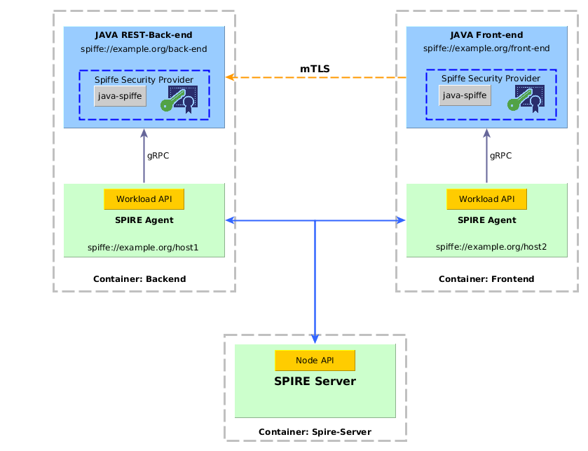

#Securing Java microservices with SPIFFE

This example shows two java applications running in Spring Boot embedded Tomcats interacting over mTLS using SVID-X509
certificates that are fetched and updated automatically from the Spire Agent using the [java-spiffe](https://github.com/spiffe/java-spiffe) library.

A Spiffe Java Security Provider has been implemented to handle the SVID with the Private Key and Trust Chain in memory
and to validate the trust chain and Spiffe ID presented by the other peer. 

The current example consists of the following modules:


_**back-end**_: simple Spring boot application with a RestController that handles GET requests over mTLS. 

_**front-end**_: simple Spring boot application that connects over mTLS with the back-end.
It accepts insecure connection over http on port _4001_ to show an html.

_**spiffe-security-provider**_: the implementation of a java security provider that handles and validates Spiffe X509-SVIDs 
certificates obtained from a Spire Agent. Used for the certificate validation during the handshake for 
establishing mTLS connections with trusted workloads. It implements a KeyStore, KeyManager and TrustManager to handle the certificates in 
memory. Uses the [java-spiffe](https://github.com/spiffe/java-spiffe) library to fetch the X509-SVIDs.

_**[java-spiffe](https://github.com/spiffe/java-spiffe)**_: library for interacting over gRPC with a Spiffe Workload API, that allows to register a listener
so the the Spiffe Agent pushes the SVIDs to the listener every time there are new ones issued. It implements exponential backoff retries in case of errors interacting with the 
Workload API.

_**acl-manager**_: implementation of a simple manager for handling a list of trusted Spiffe IDs. 


## Demo scenario 


### Components

This demo is composed of 3 containers: two workloads with their respective SPIRE agents and one SPIRE server.



#### Registration Entries

| Workload        | Selector      | SPIFFE ID                           | Parent ID                  |
| --------------- | --------------|-------------------------------------| ---------------------------|
| Java Back-end   | unix:uid:1000 | spiffe://example.org/back-end       | spiffe://example.org/host1 |
| JAVA Front-end  | unix:uid:1000 | spiffe://example.org/front-end      | spiffe://example.org/host2 | 


### Run the demo

##### Prerequisites
- MacOS or Linux 
- [Docker](https://docs.docker.com/install/)
- [Docker Compose](https://docs.docker.com/compose/install/)

##### 1. Clone this Repo
##### 2. Build and Run the docker containers

```
$ make demo
```

##### 3. Run the Spire Server 

Open a console and connect to spire-server container:
```
$ docker-compose exec spire-server bash
$ ./spire-server run & 
```

##### 4. Generate Tokens
###### 4.1 Generate Agent Token for Back-end and Run the Agent

On the spire-server console:
```
$ ./spire-server token generate -spiffeID spiffe://example.org/host1
```
Copy the Token.
Open another console and connect to back-end container, then run the Spire Agent

```
$ docker-compose exec back-end bash
$ ./spire-agent run -joinToken {token}
```
Replace `{token}` by the generated token.

###### 4.2 Generate Agent Token for Front-end and Run the Agent

On the spire-server console:
```
$ ./spire-server token generate -spiffeID spiffe://example.org/host2
```
Copy the Token.
Open another console and connect to front-end container, then run the Spire Agent

```
$ docker-compose exec front-end bash
$ ./spire-agent run -joinToken {token}
```
Replace `{token}` by the generated token.


##### 5. Create entries on spire server for the workloads

On the spire-server console run:
```
$ ./spire-server entry create -parentID spiffe://example.org/host1 -spiffeID spiffe://example.org/back-end -selector unix:uid:1000 -ttl 120
$ ./spire-server entry create -parentID spiffe://example.org/host2 -spiffeID spiffe://example.org/front-end -selector unix:uid:1000 -ttl 120
```

This entries are configured with a TTL of 120s to show the rotation of certificates and how it continues working when the 
certificates are pushed from the Spire Agent to the workloads.


##### 6. Run the apps
 
##### 6.1 Run the Back-end 

```
$ docker-compose exec back-end bash
$ cd /opt/back-end
$ ./run-backend
```

Check on the console that the correct Spiffe ID has been received:

```
INFO    spiffe.api.provider.SpiffeSVIDManager: Spiffe ID fetched: spiffe://example.org/back-end
```

##### 6.2 Run the Front-end 

```
$ docker-compose exec front-end bash
$ cd /opt/front-end
$ ./run-frontend
```

Check on the console that the correct Spiffe ID has been received:

```
INFO    spiffe.api.provider.SpiffeSVIDManager: Spiffe ID fetched: spiffe://example.org/front-end
```


##### 7. Open Web App

Open a browser an go to [http://localhost:4001/tasks](http://localhost:4001/tasks)

The page should be displayed without errors. 

On the back-end console you should see this line:

```
INFO  s.api.provider.SpiffeTrustManager - Checking SpiffeID spiffe://example.org/front-end
```

On the front-end console you should see this line:

```
INFO  s.api.provider.SpiffeTrustManager - Checking SpiffeID spiffe://example.org/back-end
```


##### 8. Run the Front-end with another identity

Registry another workload

On the spire-server console run:
```
$ ./spire-server entry create -parentID spiffe://example.org/host2 -spiffeID spiffe://example.org/front-end2 -selector unix:uid:1001 -ttl 120
```

On the Front-end console, stop the app and run:

```
$ ./run-frontend frontend2
```

Check on the console that the correct Spiffe ID has been received:

```
INFO    spiffe.api.provider.SpiffeSVIDManager: Spiffe ID fetched: spiffe://example.org/front-end2
```

As this SpiffeID is not trusted by the Backend, the web page will show an error. 

Now if you want the server to trust the new Spiffe ID, go the Backend console and edit the file `spiffe-id_whitelist-back` that is in `/opt/back-end`. 
Add a line with `spiffe://example.org/front-end2`

Try again on the browser. Now the page should display correctly. 
