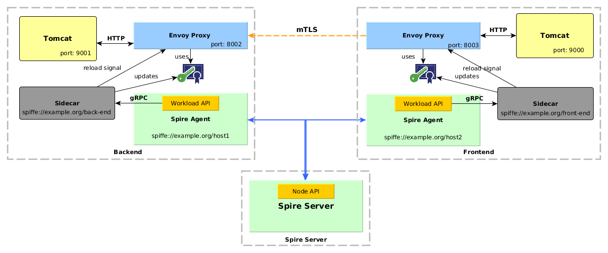

# SPIFFE Envoy's Sidecar

This demo shows an example using [Envoy](https://www.envoyproxy.io/docs/envoy/latest/) to handle mTLS connections running 
along with the [SPIFFE Helper - Sidecar](https://github.com/spiffe/spiffe-helper) to fetch the SVIDs from the Workload API. 
It's based on SPIRE version 0.6.0.

The **SPIFFE Helper** is a simple utility that works as a _Sidecar_ that fetches asynchronously X.509 SVID certificates 
from the SPIFFE Workload API, launches the **Envoy** process and continuously gets new SVID certificates before they expire. 
The Envoy process is signaled to reload the certificates when they have been updated.

Envoy Proxy handles the mTLS connections using the SVID certificates and validates the SPIFFE IDs. 

## Demo scenario 

### Components

This demo is composed of 3 containers as seen in the following diagram:



The _**Sidecar**_ is a process that connects to the [SPIRE Agent](https://github.com/spiffe/spire) through the Workload API 
and receives the SVIDs over a gRPC stream. Each new SVID update is stored in `/tmp/certs` and then a renew signal `SIGHUP` is sent to Envoy process
to reload the certificates. 

Envoy Proxy on the Frontend handles the requests from Tomcat, establishes an mTLS connection with the Envoy Proxy on 
the Backend using the SVIDs to authenticate itself and validates the peer's identity. 
Envoy Proxy on the Backend handles the requests from the Frontend and routes them to the Tomcat on its container. 

#### Registration Entries

| Workload        | Selector      | SPIFFE ID                           | Parent ID                  |
| ----------------| --------------|-------------------------------------| ---------------------------|
| Back-end        | unix:uid:1000 | spiffe://example.org/back-end       | spiffe://example.org/host1 |
| Front-end       | unix:uid:1000 | spiffe://example.org/front-end      | spiffe://example.org/host2 | 

### Run the demo

##### Prerequisites

- Linux or macOS
- [Docker](https://docs.docker.com/install/)
- [Docker Compose](https://docs.docker.com/compose/install/)

##### 1. Clone this repo

##### 2. Build and run the docker containers

```
$ make build

Successfully built
```

Run the containers:

```
$ make run

docker-compose up -d
Creating network "spiffeenvoydemo_default" with the default driver
Creating spiffeenvoydemo_spire-server_1 ...
Creating spiffeenvoydemo_spire-server_1 ... done
Creating spiffeenvoydemo_backend_1 ...
Creating spiffeenvoydemo_backend_1 ... done
Creating spiffeenvoydemo_frontend_1 ...
Creating spiffeenvoydemo_frontend_1 ... done
```

##### 4. Run the SPIRE Server 

On a console run:

```
$ docker-compose exec spire-server ./spire-server run 

INFO[0000] plugins started
INFO[0000] Starting gRPC server                          subsystem_name=endpoints
INFO[0000] Starting HTTP server                          subsystem_name=endpoints 
```

##### 5. Create the workloads entries

On a console run:

```
$ docker-compose exec spire-server ./create-entries.sh

+ ./spire-server entry create -parentID spiffe://example.org/host1 -spiffeID spiffe://example.org/back-end -selector unix:uid:1000 -ttl 120
Entry ID: aed86831-38ec-40f9-bbe5-7bf88f84f788
SPIFFE ID: spiffe://example.org/back-end
Parent ID: spiffe://example.org/host1
TTL: 120
Selector: unix:uid:1000

+ ./spire-server entry create -parentID spiffe://example.org/host2 -spiffeID spiffe://example.org/front-end -selector unix:uid:1000 -ttl 120
Entry ID: 3c1ffb41-cb2f-4393-9eb5-52b17e9cc28e
SPIFFE ID: spiffe://example.org/front-end
Parent ID: spiffe://example.org/host2
TTL: 120
Selector: unix:uid:1000
```

##### 6. Generate Tokens

###### 6.1 Generate Agent Token for Back-end and Run the Agent

On the console run:
```
$ docker-compose exec spire-server ./spire-server token generate -spiffeID spiffe://example.org/host1

Token: b0cab4ab-ddcd-4403-862c-325fe599f661
```

Copy the Token, then connect to Backend container:

```
$ docker-compose exec backend bash
```

Inside the container:

```
# cd /opt/spire
# ./spire-agent run -joinToken {token}

DEBU[0000] Requesting SVID for spiffe://example.org/back-end  subsystem_name=manager
DEBU[0000] Requesting SVID for spiffe://example.org/host1  subsystem_name=manager
INFO[0000] Starting workload API                         subsystem_name=endpoints
```

Replace `{token}` by the generated token.

###### 6.2 Generate Agent Token for Front-end and Run the Agent

On the console run:
```
$ docker-compose exec spire-server ./spire-server token generate -spiffeID spiffe://example.org/host2

Token: 81d70337-b255-446e-bb70-5eae5655a876
```

Copy the Token, then connect to Backend container:

```
$ docker-compose exec frontend bash
```

Inside the container: 

```
# cd /opt/spire
# ./spire-agent run -joinToken {token}

DEBU[0000] Requesting SVID for spiffe://example.org/back-end  subsystem_name=manager
DEBU[0000] Requesting SVID for spiffe://example.org/host2  subsystem_name=manager
INFO[0000] Starting workload API                         subsystem_name=endpoints
```

Replace `{token}` by the generated token.

##### 7. Start the Tomcats

###### 7.1 Run the Back-end

On a console run:

```
$ docker-compose exec backend /opt/back-end/start-tomcat.sh

INFO [main] org.apache.catalina.startup.Catalina.start Server startup 
```

###### 7.2 Run the Front-end

On a console run:

```
$ docker-compose exec frontend /opt/front-end/start-tomcat.sh

INFO [main] org.apache.catalina.startup.Catalina.start Server startup
```

##### 8. Open Web App

Open a browser an go to [http://localhost:9000/tasks](http://localhost:9000/tasks)

The page should be displayed without errors.

##### 9. Clean the environment 

Stop the docker containers:

```
$ make clean

docker-compose down
Stopping spiffeenvoysidecar_frontend_1     ... done
Stopping spiffeenvoysidecar_backend_1      ... done
Stopping spiffeenvoysidecar_spire-server_1 ... done
Removing spiffeenvoysidecar_frontend_1     ... done
Removing spiffeenvoysidecar_backend_1      ... done
Removing spiffeenvoysidecar_spire-server_1 ... done
Removing network spiffeenvoysidecar_default
```

### References

[Envoy documentation](https://www.envoyproxy.io/docs/envoy/latest/)

[Envoy v2 API reference](https://www.envoyproxy.io/docs/envoy/latest/api-v2/api)

[SPIFFE Runtime Environment](https://github.com/spiffe/spire)

[SPIFFE Helper - Sidecar](https://github.com/spiffe/spiffe-helper)